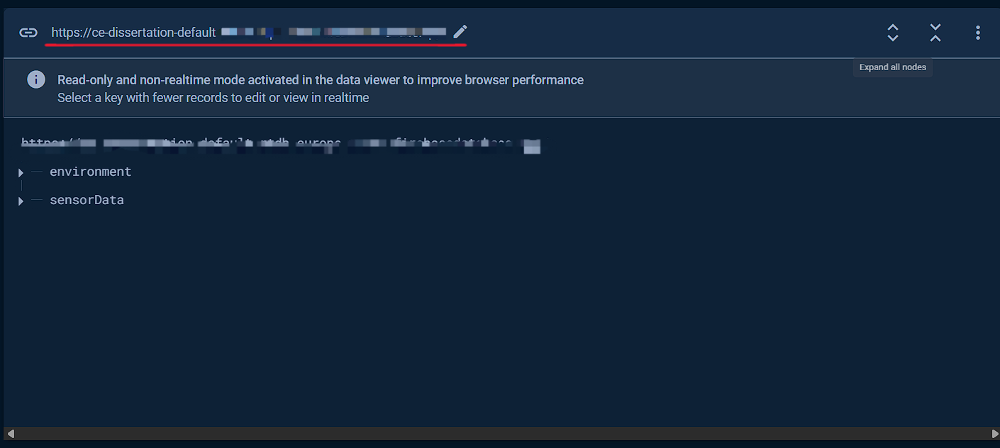
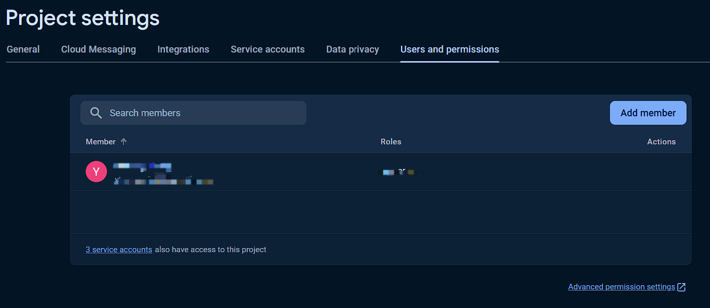

# :cup_with_straw: HydroTrack

[](https://github.com/Ereshkigallll/CE_Dissertation/blob/main/README_CN.md)


## 1. Introduction :yum:

HydroTrack is an advanced hydration tracking system that utilises smart IoT technology to monitor water intake and employs deep learning models to classify beverage types. The system comprises three components: an Attachment installed at the base of the cup, a Docking Station that displays hydration data, classifies beverages, and charges the Attachment, and a mobile application for manually uploading data. Together, these elements synergistically help users develop healthy hydration habits.


## 2. Pre-request :hammer_and_wrench:

### 2.1 General Request

- 3D Printer and filament
- Soldering iron
- Laser Cutting

### 2.2 Attachment
- 820mA lithium polymer battery
- DFRobot ESP32-C6 mini development board [Product wiki](https://wiki.dfrobot.com/SKU_DFR1117_Beetle_ESP32_C6)
- Magnetic Charging Contactor 
- Non-contact ultrasonic liquid level sensor

### 2.3 Docking Station
- Raspberry Pi 4B
- DHT22
- WaveShare 5.65-inches 7 color e-ink screen [Product wiki](https://www.waveshare.net/wiki/5.65inch_e-Paper_Module_(F)_Manual#.E5.90.84.E9.A1.B9.E5.8F.82.E6.95.B0)
- DFRobot infrared CO2 sensor [Product wiki](https://wiki.dfrobot.com/SKU_SEN0536_Gravity_SCD41_Infrared_CO2_Sensor)
- Raspberry Pi camera module
- WS2812 ring shape LED board

## 3. Files and Usage :card_file_box:

### 3.1 `0_Devices`

This folder contains files divided into two sections: docking station and attachment. Within `0_docking_station`, the `Rpi_code` contains the necessary code for the Raspberry Pi, while the files in `e-paper_assets` are the project files used to create backgrounds for the e-paper display, which you may modify as needed.

The code within `1_attachment` is designed for use with the ESP32-C6. When using this, you will need to create an additional file named secret.h to store your sensitive information. The information to be included is as follows:
```
// WiFi 
#define WIFI_SSID "Your WiFi Name Here"
#define WIFI_PASSWORD "Your WiFi Password Here"

// Firebase credentials
#define DATABASE_URL "Your Firebase Database Url" 
#define FIREBASE_API_KEY "Your Firebase API Key"
#define FIREBASE_USER_EMAIL "Your Firebase User Email"
#define FIREBASE_USER_PASSWORD "Your Firebase User Password"
```

Among these, the Firebase database `URL` can be found on the main interface of the database:



The Firebase `API Key` can be found in the project settings:：


User email and password can be configured in the project settings under `Users and Permissions`:



### 3.2 `1_mobile_app`

This folder contains three subfolders, of which `hydro_track` is the project for compiling the final mobile application. The other two folders are used for unit testing and can be disregarded. If you wish to test the mobile application, you can use the following command after connecting to a virtual machine or your own phone:

```
cd hydro_track
flutter pub get
flutter run
```

### 3.3 `2_models`

This folder contains the model files for the casing of my device. After exporting from Fusion 360, these files can be sent directly to a 3D printer for production.

## 4. Usage

### 4.1 Circuit Diagram


### 4.2 Docking Station

To ensure there is no interference between projects, consider creating a dedicated Python virtual environment on the Raspberry Pi to install the libraries required for this project. All the following operations should be conducted with the virtual environment installed.

First, you need to create a virtual environment:

```
sudo apt-get update
sudo apt-get install python3-venv

python3 -m venv /path/to/virtual/environment/hydrotack --symlinks
```

Then you can use the following code to activate the virtual environment:

```
source /path/to/virtual/environment/hydrotack/bin/activate
```

After activate the environment, you can use the following code to install the packages you need：

```
pip install RPi.GPIO picamera2 Pillow torch torchvision firebase-admin adafruit-circuitpython-dht rpi_ws281x pytz
```

Then, please visit the Waveshare official website to view the tutorial on how to use the e-ink display：[E-ink screen tutorial](https://www.waveshare.net/wiki/5.65inch_e-Paper_Module_(F)_Manual#Raspberry_Pi)

After downloading the appropriate sample files and libraries, please navigate to the following directory:
```
cd e-Paper/RaspberryPi_JetsonNano/python/examples/
```

And place the `e-paper.py` from `Rpi_code/e-paper_function` and both `model.pt` and `classification.py` from `Rpi_code/DL_function` in this directory. Also, place the `private key` file generated from the Firebase database in the same directory. Then use the following command to start:

```
python e-paper.py classification.py
```

The setup for the Raspberry Pi component is now complete!

### 4.3 Attachment

Upload the code from `0_devices/1_attachment` to the ESP32-C6 and create a `secret.h` file to store sensitive information as previously mentioned. Additionally, during installation, apply a coupling agent between the ultrasonic liquid level sensor and the bottom of the cup to ensure the sensor functions properly.

## 5. Instructions

- When placing the cup with the Attachment into the charging ring, ensure that the charging contacts are aligned. Once correctly positioned, the LED lights around the ring will emit a green light, indicating that the Attachment is charging and the Raspberry Pi's beverage classification model is in operation.
- When cleaning the cup, ensure that the area around the contacts is kept dry.


