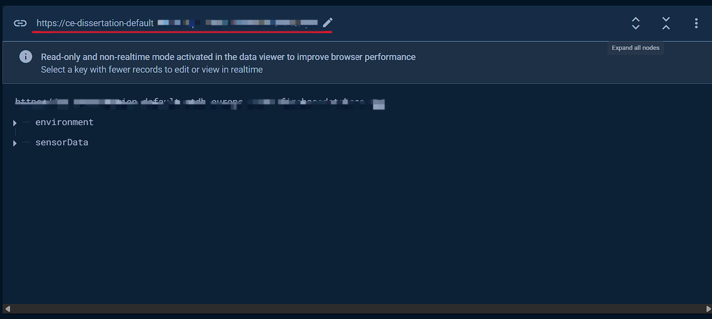
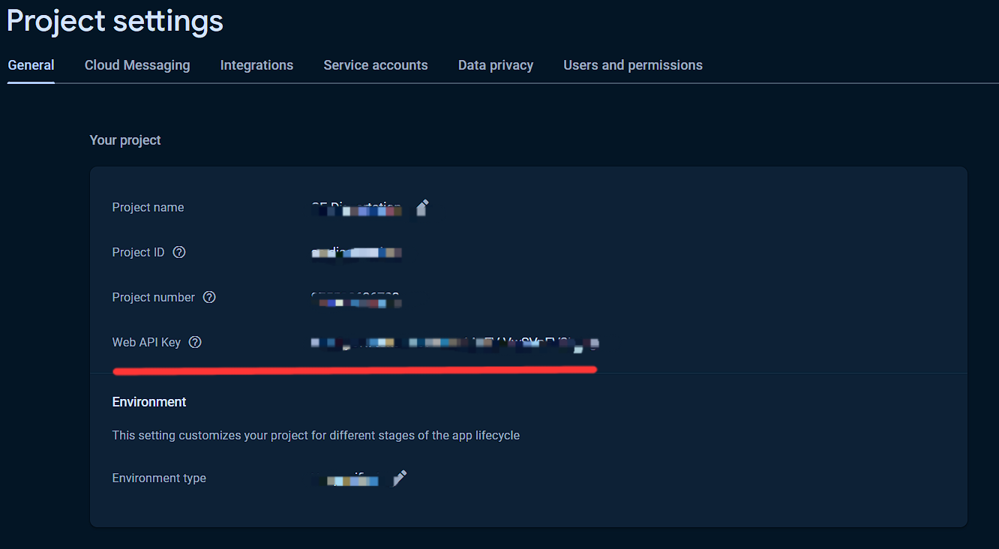
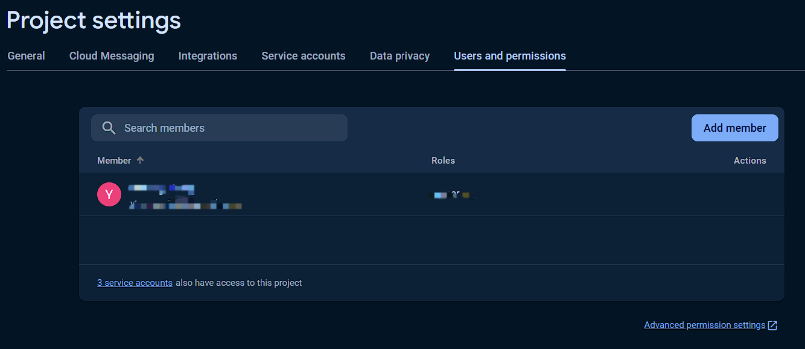

# :cup_with_straw: HydroTrack

[](https://github.com/Ereshkigallll/CE_Dissertation/tree/main)


## 1. Introduction :yum:

HydroTrack是一个基于智能物联网追踪用户水分摄入同时通过深度学习模型来分类饮料类型的饮水量追踪系统。整个系统由三个部分组成，安装在杯子底部的Attachment，用于展示饮水量信息、饮料分类以及为Attachment充电的Docking Station以及一个可以手动上传数据的移动应用。通过这三个部分的有机结合，可以帮助用户形成良好的水分摄入的习惯。

## 2. Pre-request :hammer_and_wrench:

### 2.1 General Request

- 3D打印机以及耗材
- 电烙铁
- 导线
- 激光切割

### 2.2 Attachment
- 820mA 锂电池
- DFRobot ESP32-C6迷你开发板 [产品wiki](https://wiki.dfrobot.com/SKU_DFR1117_Beetle_ESP32_C6)
- 磁吸充电触点一对
- 电应普非接触式超声波液位传感器

### 2.3 Docking Station
- 树莓派4B
- DHT22
- 微雪 5.65寸 7色电子墨水屏 [产品wiki](https://www.waveshare.net/wiki/5.65inch_e-Paper_Module_(F)_Manual#.E5.90.84.E9.A1.B9.E5.8F.82.E6.95.B0)
- DFRobot 红外光声二氧化碳传感器 [产品wiki](https://wiki.dfrobot.com.cn/_SKU_SEN0536_Gravity_SCD41_Infrared_CO2_Sensor)
- 树莓派摄像头
- WS2812 环状LED灯板

## 3. 文件以及使用 :card_file_box:

### 3.1 `0_Devices`

本文件夹中的文件被分为了docking station 以及 attachment 两个部分。其中 `0_docking_station` 中的 `Rpi_code` 是树莓派需要的代码，而 `e-paper_assets` 中的文件是被用于制作电子墨水屏的背景图的工程文件，有需要可以自行修改。

`1_attachment` 中的代码是被用于 `ESP32-C6` 的代码，在使用的时候，需要额外创建一个 `secret.h` 文件来存放自己的敏感信息。里面需要包含的信息有：
```
// WiFi 
#define WIFI_SSID "Your WiFi Name Here"
#define WIFI_PASSWORD "Your WiFi Password Here"

// Firebase credentials
#define DATABASE_URL "Your Firebase Database Url" 
#define FIREBASE_API_KEY "Your Firebase API Key"
#define FIREBASE_USER_EMAIL "Your Firebase User Email"
#define FIREBASE_USER_PASSWORD "Your Firebase User Password"
```

其中，Firebase的数据库 `URL` 可以在数据库的主界面找到：


Firebase的 `API Key` 可以在项目的设置中找到：


用户邮箱和密码可以在项目设置中的 Users and Permissions 中自己设置：
